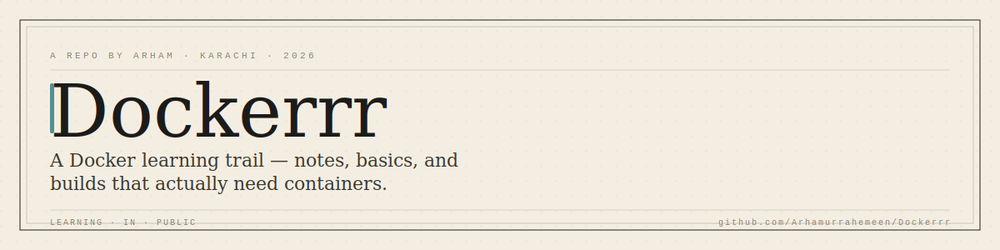
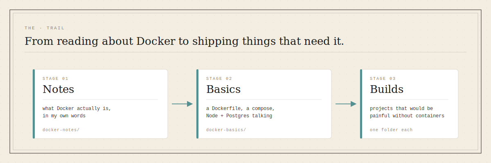
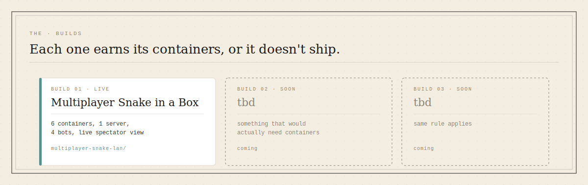

  

# Dockerrr

> A Docker learning trail — notes, basics, and builds that actually need containers.

This isn't a Docker tutorial and it isn't a curated portfolio. It's where I'm learning Docker in public and shipping the builds that come out of it. Notes get messy first, then they get real, then a build shows up that couldn't have been done cleanly without containers. That's the whole shape.

Companion to [The Arham Way](https://github.com/Arhamurrahemeen/The-Arham-Way) — same person, same voice, different job. The Arham Way is where I write about *how* I build. Dockerrr is where I actually do it, with containers.

## The trail

  

Three folders, three stages, each one earning the next.

| Stage | Folder | What's in it |
|---|---|---|
| 01 · Notes | [`docker-notes/`](docker-notes/) | What Docker actually is — in my own words, not the docs' words. Reference material I come back to. |
| 02 · Basics | [`docker-basics/`](docker-basics/) | The smallest thing that proves I understood the notes. Node app, Dockerfile, compose with Postgres. Two containers saying hello. |
| 03 · Builds | one folder each (see below) | Projects that would be genuinely painful without containers. If a build could have been a `python script.py`, it doesn't belong here. |

The rule for anything in `builds/`: **can I explain, in one line, why this needed containers?** If I can't, it goes back to `basics/` or gets cut.

## The builds

  

### 01 · [Multiplayer Snake in a Box](multiplayer-snake-lan/) — live

Six containers, one authoritative game server, four bots each running as its own process, one spectator page that anyone on the LAN can join from. Kill a bot mid-game and the server doesn't blink. This is what I mean by *actually needing containers* — every process on `docker ps` is doing real, isolated work. [Go to build →](multiplayer-snake-lan/)

More coming. The bar stays the same: if it could've been a script, it doesn't ship here.

## How to read this repo

If you landed here from LinkedIn or a demo clip, go straight to [multiplayer-snake-lan/](multiplayer-snake-lan/) — that's the one with a live board and a `docker ps` moment.

If you're learning Docker yourself, start at [docker-notes/](docker-notes/), then [docker-basics/](docker-basics/), then read the snake build's README to see where it goes when the training wheels come off.

## Stack

*As of July 2026 — the folder structure doesn't care which versions these are.*

- Docker + Docker Compose
- Whatever the build needs inside its containers — Node, Python, nginx, Postgres so far

Learn one thing. Ship one thing. Move on.

— Arham
